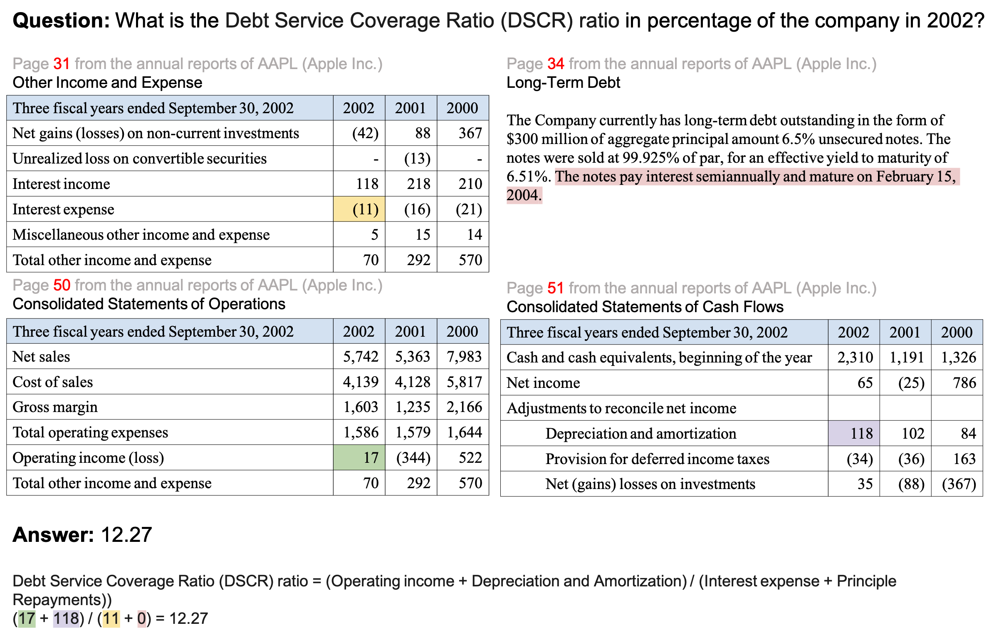

# FinLongDocQA

**Numerical Reasoning across Multiple Tables for Document-Level Financial Question Answering**

[](https://huggingface.co/datasets/Amian/FinLongDocQA)

## Dataset Description



*An example QA instance from FinLongDocQA. The figure shows only the relevant tables and text for presentation; in practice, the model must retrieve them from the full annual report before computing the answer.*

FinLongDocQA is a benchmark for financial numerical reasoning over long, structured annual reports. It covers both **single-table** and **cross-table** settings where answering a question requires integrating evidence scattered across multiple tables and narrative text.

Financial annual reports commonly exceed 129k tokens, making it challenging for LLMs to (1) locate the relevant tables (*context rot*) and (2) perform accurate multi-step arithmetic once the evidence is found. FinLongDocQA is designed to stress-test both capabilities.

### Dataset Summary

| Field | Value |
|---|---|
| Examples | 7,527 |
| Companies | 489 |
| Fiscal years | 2022, 2023, 2024 |
| Question types | `mixed` (5,951), `table` (1,319), `text` (257) |

### Question Types

| Type | Description |
|---|---|
| `table` | Evidence comes entirely from one or more financial tables |
| `text` | Evidence comes entirely from narrative text |
| `mixed` | Evidence spans both tables and narrative text |

## Dataset Structure

Each record in `dataset_qa.jsonl` contains:

```json
{
  "id": "1",
  "company": "A",
  "year": "2022",
  "question": "On average, how many manufacturing facilities does each business segment have?",
  "type": "mixed",
  "thoughts": "Thought: Page 4 cites 3 segments. Page 11 lists 4 U.S. and 4 non-U.S. manufacturing facilities = 8 total. Average = 8/3.",
  "page_numbers": [4, 11],
  "python_code": "total_facilities=8\nsegments=3\navg=total_facilities/segments\nround(avg,2)",
  "answer": 2.67
}
```

### Fields

| Field | Type | Description |
|---|---|---|
| `id` | string | Unique example identifier |
| `company` | string | Anonymized company ticker |
| `year` | string | Fiscal year of the annual report |
| `question` | string | Natural-language financial question |
| `type` | string | Question type: `table`, `text`, or `mixed` |
| `thoughts` | string | Chain-of-thought reasoning trace with page references |
| `page_numbers` | list[int] | Pages in the annual report that contain the relevant evidence |
| `python_code` | string | Executable Python snippet that computes the answer |
| `answer` | float | Ground-truth numerical answer |

## Usage

```python
from datasets import load_dataset

ds = load_dataset("Amian/FinLongDocQA")
print(ds["train"][0])
```

## Associated Paper

> **Numerical Reasoning across Multiple Tables for Document-Level Financial Question Answering**
>
> Despite the strong language understanding abilities of large language models (LLMs), they still struggle with reliable question answering (QA) over long, structured documents, particularly for numerical reasoning. Financial annual reports exemplify this difficulty: financial statement analysis often hinges on accurate arithmetic, and analysts derive key indicators by integrating evidence scattered across multiple tables and narrative text. However, existing benchmarks focus largely on single-table settings, leaving cross-table document-level numerical reasoning underexplored. To address this gap, we introduce **FinLongDocQA**, a dataset for both single-table and cross-table financial numerical reasoning in long-context reports. Evaluating both closed-source and open-source LLMs on FinLongDocQA reveals two bottlenecks: (1) annual reports often exceed 129k tokens, exacerbating the *context rot* problem for locating relevant tables; and (2) even when relevant evidence is located, LLMs remain prone to errors in multi-step numerical reasoning. We propose **FinLongDocAgent**, a Multi-Agent Multi-Round Retrieval-Augmented Generation (RAG) approach that iteratively retrieves evidence, performs intermediate calculations, and verifies results across rounds. Experiments highlight the importance of iterative retrieval and verification for reliable numerical QA in long financial documents.

## License

This dataset is released under the **AI²Lab Source Code License (National Taiwan University)**.
See the full license [here](LICENSE).
