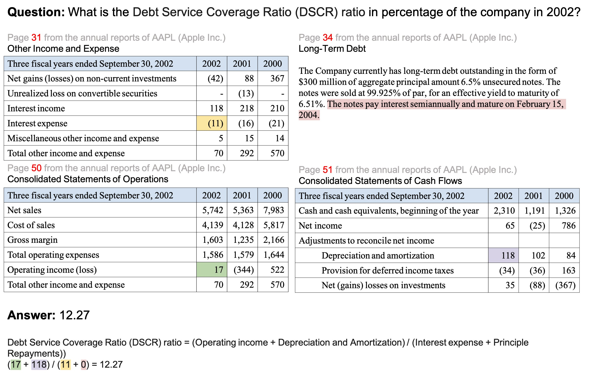

# FinLongDocQA

**Document-Level Numerical Reasoning across Single and Multiple Tables in Financial Reports**

[](https://huggingface.co/datasets/Amian/FinLongDocQA)
[](https://arxiv.org/abs/2604.03664)

## Dataset Description



*An example QA instance from FinLongDocQA. The figure shows only the relevant tables and text for presentation; in practice, the model must retrieve them from the full annual report before computing the answer.*

FinLongDocQA is a benchmark for financial numerical reasoning over long, structured annual reports. It covers both **single-table** and **cross-table** settings where answering a question requires integrating evidence scattered across multiple tables and narrative text.

Financial annual reports commonly exceed 129k tokens, making it challenging for LLMs to (1) locate the relevant tables (*context rot*) and (2) perform accurate multi-step arithmetic once the evidence is found. FinLongDocQA is designed to stress-test both capabilities.

> Annual reports used in this dataset can be downloaded [here](https://drive.google.com/file/d/1MySo4fFBEeht7lVasDCVrvHWki8Yvkkk/view?usp=drive_link).

### Dataset Summary

| Field | Value |
|---|---|
| Examples | 7,527 |
| Companies | 489 |
| Fiscal years | 2022, 2023, 2024 |
| Question types | `mixed` (5,951), `table` (1,319), `text` (257) |

### Question Types

| Type | Description |
|---|---|
| `table` | Evidence comes entirely from one or more financial tables |
| `text` | Evidence comes entirely from narrative text |
| `mixed` | Evidence spans both tables and narrative text |

## Dataset Structure

Each record in `dataset_qa.jsonl` contains:

```json
{
  "id": "1",
  "company": "A",
  "year": "2022",
  "question": "On average, how many manufacturing facilities does each business segment have?",
  "type": "mixed",
  "thoughts": "Thought: Page 4 cites 3 segments. Page 11 lists 4 U.S. and 4 non-U.S. manufacturing facilities = 8 total. Average = 8/3.",
  "page_numbers": [4, 11],
  "python_code": "total_facilities=8\nsegments=3\navg=total_facilities/segments\nround(avg,2)",
  "answer": 2.67
}
```

### Fields

| Field | Type | Description |
|---|---|---|
| `id` | string | Unique example identifier |
| `company` | string | Anonymized company ticker |
| `year` | string | Fiscal year of the annual report |
| `question` | string | Natural-language financial question |
| `type` | string | Question type: `table`, `text`, or `mixed` |
| `thoughts` | string | Chain-of-thought reasoning trace with page references |
| `page_numbers` | list[int] | Pages in the annual report that contain the relevant evidence |
| `python_code` | string | Executable Python snippet that computes the answer |
| `answer` | float | Ground-truth numerical answer |

## Usage

```python
from datasets import load_dataset

ds = load_dataset("Amian/FinLongDocQA")
print(ds["test"][0])
```

## FinLongDocAgent

We provide **FinLongDocAgent**, a Multi-Agent Multi-Round RAG baseline for this benchmark.
It decomposes each question into iterative retrieval and reasoning rounds:
an **ExpansionAgent** generates domain-aware queries, a **SolvingAgent** computes intermediate results from retrieved pages, and an **EvaluationAgent** verifies the answer and feeds missing components back for the next round.

See [FINLONGDOCAGENT.md](FINLONGDOCAGENT.md) for setup and usage instructions.

## Citation

If you find this dataset or the method helpful, please cite our paper:

```
@article{wang2026finlongdocqa,
  title={Document-Level Numerical Reasoning across Single and Multiple Tables in Financial Reports},
  author={Wang, Yi-Cheng and Wang, Wei-An and Chen, Chu-Song},
  journal={arXiv preprint arXiv:2604.03664},
  year={2026}
}
```

## License

This dataset is released under the **AI²Lab Source Code License (National Taiwan University)**.
See the full license [here](LICENSE).
